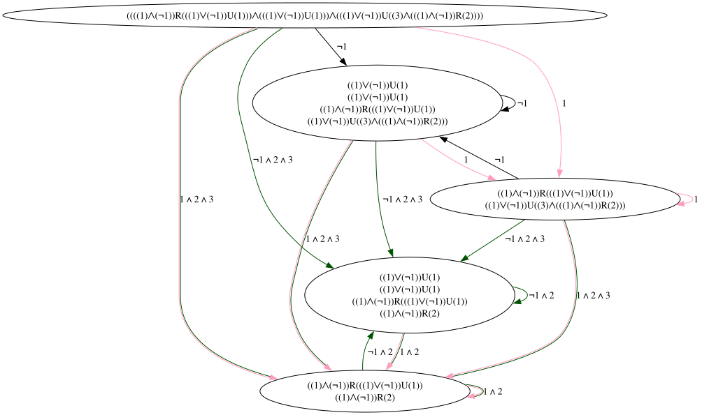

# ω-Automata

This rust library implements decision procedures and algorithms on
__omega-automata__. __Omega-automata__ are similar to the better-known finite
automata (NFA/DFA/...) except they operate on *infinite* words. They are
commonly used to model systems that can run for an infinite time, such as most
algorithms, protocols, and more.

For example, model checking temporal logic properties (commonly used in formal
hardware verification) can be implemented with an optimal worst-case time
complexity via omega automata.

## Features

Currently, this crate supports the following:

- LTL to VWABW (*very weak alternating büchi automata*) translation.
- VWABW to GBW (*generalized büchi automata*) translation.

## Planned features

- GBW to NBW (*non-deterministic büchi automata*) translation.
- NBW emptiness check.

With the planned features, it will be possible to check LTL formulas for
satisfiability.

## Example

Let's start with the LTL formula $\varphi = \left(\square \lozenge x_1 \wedge \lozenge
x_1\right) \wedge \left(\lozenge\left(x_3 \wedge \square x_2\right)\right)$.  
Intuitively, $\varphi$ states that any sequence $w = s_1, s_2, s_3, \dotsc \in
X^\omega$ of variable assignments (the structure LTL is interpreted over) must
first have infinite $x_1 \in s_i$ (also pronounced *$w$ must have infinitely
often $x_1$*), and second it must eventually reach a position $s_k$ such that
$x_3, x_2 \in s_k$ and $x_2 \in s_j$ for all $s_j$ following $s_k$ (also
pronounced $x_2$ must hold from $s_k$).

Translating the LTL formula $\varphi$ to a GBW results in the following
automata. The GBW has two sets of accepting edges (green and pink). In order to
accept and infinite word, its run must take infinite edges from both sets.
Notice that the node labels are more verbose due to being automatically
generated using multiple normalization steps.
 
Looking closely, one can see that the automata accepts exactly the words
satisfying $\varphi$.

## Resources

1. [Clarke et al. *Handbook of Model Checking*](https://doi.org/10.1007/978-3-319-10575-8)
2. [Gastin and Oddoux *Fast LTL to Büchi Automata Translation*](https://doi.org/10.1007/3-540-44585-4_6)